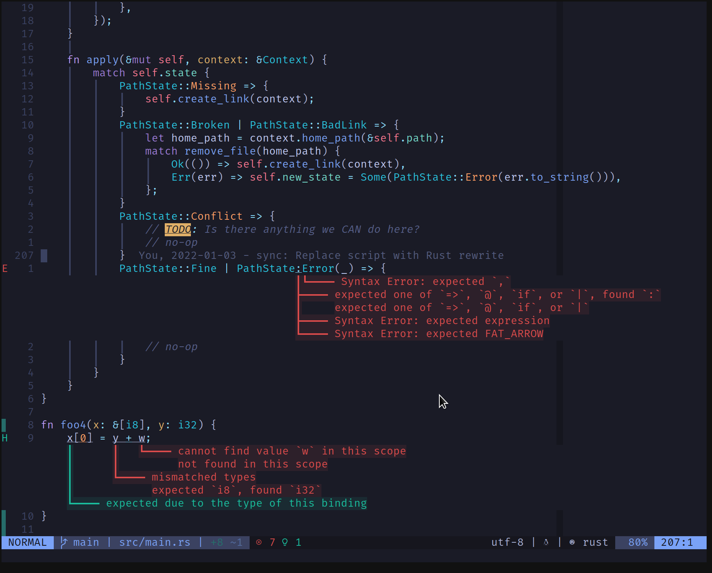

# Introduction

Just a clone of [this](https://git.sr.ht/~whynothugo/lsp_lines.nvim) repo,
created by Hugo Osvaldo Barrera, and is hosted on sourcehut.

This repo was originally created for compatability with vim-plug; however, I've
since learned [#1](https://github.com/ksyasuda/lsp_lines.nvim/issues/1) that vim-plug is able to handle any valid git url,
so there is no need for this repository to exist

I will keep the repo up for some time to provide backwards compatability with
old configurations making use of this repo, as well as providing
some small amount of visibility to this project

# lsp_lines.nvim

`lsp_lines` is a simple neovim plugin that renders diagnostics using virtual
lines on top of the real line of code.



Font is [Fira Code][font], a classic.
Theme is [tokyonight.nvim][theme].

[font]: https://github.com/tonsky/FiraCode
[theme]: https://github.com/folke/tokyonight.nvim

# Background

LSPs provide lots of useful diagnostics for code (typically: errors, warnings,
linting). By default they're displayed using virtual text at the end of the
line which is in many cases good enough, but often there's more than one
diagnostic per line. It's also quite common to have more than one diagnostic
per line, but again, there's no handy way to read the whole thing.

`lsp_lines` solves this issue.

# Installation

Using [vim-plug](https://github.com/junegunn/vim-plug)

```vim
Plug 'ksyasuda/lsp_lines.nvim'
```

Using packer.nvim (should probably be registered _after_ `lspconfig`):

## With packer.nvim

Using packer.nvim (this should probably be registered _after_ `lspconfig`):

```lua
use({
  "https://github.com/ksyasuda/lsp_lines.nvim",
  config = function()
    require("lsp_lines").setup()
  end,
})
```

## With git

You can algo just clone the repo into neovim's plug-in directory:

    mkdir -p $HOME/.local/share/nvim/site/pack/plugins/start/
    cd $HOME/.local/share/nvim/site/pack/plugins/start/
    git clone https://github.com/ksyasuda/lsp_lines.nvim

And then in `init.lua`:

    require("lsp_lines").setup()

# Setup

It's recommended to also remove the regular virtual text diagnostics to avoid
pointless duplication:

```lua
-- Disable virtual_text since it's redundant due to lsp_lines.
vim.diagnostic.config({
  virtual_text = false,
})
```

# Usage

This plugin's functionality can be disabled with:

```lua
vim.diagnostic.config({ virtual_lines = false })
```

And it can be re-enabled via:

```lua
vim.diagnostic.config({ virtual_lines = true })
```

To show virtual lines only for the current line's diagnostics:

```lua
vim.diagnostic.config({ virtual_lines = { only_current_line = true } })
```

A helper is also provided to toggle, which is convenient for mappings:

```lua
vim.keymap.set(
  "",
  "<Leader>l",
  require("lsp_lines").toggle,
  { desc = "Toggle lsp_lines" }
)
```

# Contributing

- Discussion or patches: ~whynothugo/lsp_lines.nvim@lists.sr.ht
- Issues: <https://todo.sr.ht/~whynothugo/lsp_lines.nvim>
- Tips: <https://ko-fi.com/whynothugo>
- Bugs / Issues: <https://todo.sr.ht/~whynothugo/lsp_lines.nvim>

# Development

It would be nice to show connecting lines when there's relationship between
diagnostics (as is the case with `rust_analyzer`). Oh perhaps surface them via
hover().

# Licence

This project is licensed under the ISC licence. See LICENCE for more details.
